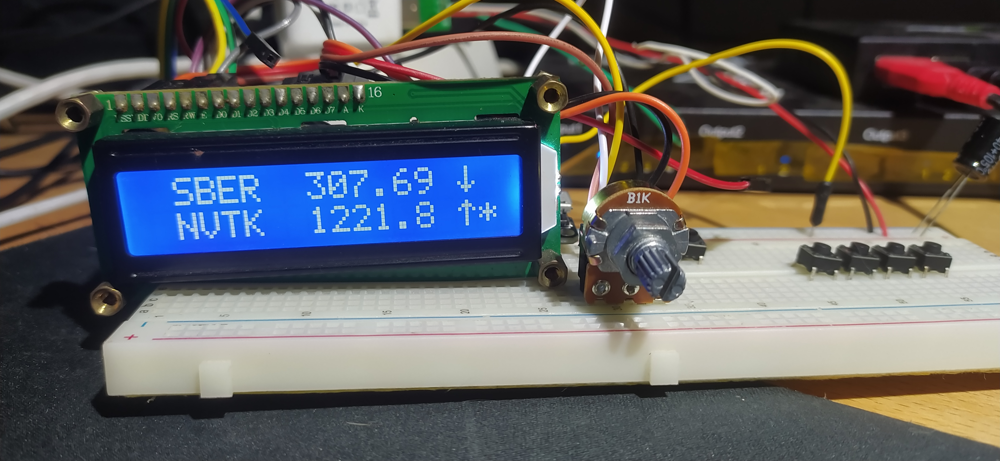

# ESP32 Биржевой Тикер

## Описание
Этот проект представляет собой биржевой тикер на базе ESP32, который отображает текущие цены акций с Московской биржи (MOEX) на ЖК-дисплее (16x2). Пользователи могут добавлять, удалять и обновлять тикеры через веб-интерфейс, задавать пороговые цены для сигналов покупки или продажи, а также настраивать интервалы обновления данных и смены тикеров на дисплее. Проект поддерживает OTA (Over-The-Air) обновления для упрощения прошивки.

### Основные возможности
- **Отображение цен акций**: Получение данных о ценах с MOEX через API.
- **ЖК-дисплей**: Формат строки: индикатор (`.` при обновлении, `x` при ошибке, пробел при успехе) + 4-символьный тикер + пробел + цена (7 символов) + пробел + стрелка (↑/↓) + звездочка/пробел (для сигнала покупки).
- **Веб-интерфейс**: Добавление, удаление и обновление тикеров, настройка интервалов.
- **EEPROM**: Хранение тикеров и настроек в энергонезависимой памяти.
- **OTA обновления**: Удаленная загрузка новых прошивок через Wi-Fi.
- **Индикаторы сигналов**: Стрелка вверх/вниз в зависимости от цены относительно порога, звездочка для сигнала покупки (цена ниже порога).

## Требования
- **Аппаратное обеспечение**:
  - ESP32 (например, ESP32 DevKit v1).
  - ЖК-дисплей 16x2 с интерфейсом I2C или совместимый (пины: 23, 22, 21, 19, 18, 5).
  - Подключение к Wi-Fi.
- **Программное обеспечение**:
  - Arduino IDE с установленной поддержкой ESP32.
  - Библиотеки: `WiFi`, `HTTPClient`, `ArduinoJson`, `Wire`, `LiquidCrystal`, `WebServer`, `EEPROM`, `ESPmDNS`, `NetworkUdp`, `ArduinoOTA`.

## Установка
1. **Настройка Arduino IDE**:
   - Установите Arduino IDE и добавьте поддержку ESP32 через Board Manager.
   - Установите библиотеки: `ArduinoJson`, `ESPmDNS`, `ArduinoOTA`.

3. **Загрузка кода**:
   - Подключите ESP32 к компьютеру через USB.
   - Загрузите код `ticker-tape-machine.ino` через Arduino IDE.

4. **OTA настройка**:
   - Убедитесь, что ESP32 подключен к той же Wi-Fi сети, что и компьютер для OTA.
   - Имя хоста: `TickerMashine`, пароль: `admin`, порт: `3232`.

## Функционалность WiFi менеджера
Была реализована система управления WiFi подключением с автоматическим переходом в режим точки доступа при проблемах с подключением.

### Основные возможности:
1. **Автоматический режим точки доступа**
   - После 10 неудачных попыток подключения к сохраненной сети устройство автоматически запускает точку доступа
   - Параметры точки доступа по умолчанию:
     - SSID: `TickerTapeAP`
     - Пароль: `config123`

2. **Веб-интерфейс для настройки**
   - Доступен по адресу `http://192.168.4.1` в режиме точки доступа
   - Позволяет ввести новые параметры WiFi сети
   - Сохраняет настройки в энергонезависимой памяти

3. **Интеграция с LCD дисплеем**
   - В режиме точки доступа на дисплее отображается информация для подключения
   - Чередуется показ SSID и пароля точки доступа

4. **Сохранение старых настроек**
   - Старые параметры WiFi не удаляются до успешного подключения к новой сети
   - После перезагрузки устройство пытается подключиться к новой сети

### Как использовать:

1. **При первом включении или при проблемах с подключением:**
   - Подключитесь к сети `TickerTapeAP` с паролем `config123`
   - Откройте браузер и перейдите на `http://192.168.4.1`
   - Введите параметры вашей WiFi сети
   - Сохраните настройки и дождитесь перезагрузки устройства

2. **Через основной веб-интерфейс:**
   - При подключении к устройству через WiFi
   - Перейдите в раздел "WiFi Settings"
   - Измените параметры подключения при необходимости

### Технические детали:

- Для хранения настроек используется библиотека Preferences
- Подсчет неудачных попыток подключения ведется автоматически
- После успешного подключения счетчик неудачных попыток сбрасывается
- Реализована защита от постоянных перезагрузок при неверных настройках

## Использование

1. **Запуск устройства**:
   - После загрузки ESP32 подключится к Wi-Fi и отобразит IP-адрес на дисплее.
   - Откройте веб-браузер и перейдите по адресу `http://<IP-адрес>`.

2. **Веб-интерфейс**:
   - **Добавить тикер**: Введите тикер (например, `SBER`), пороговую цену и выберите тип сигнала (покупка/продажа).
   - **Обновить тикер**: Измените порог и тип сигнала, нажмите "Обновить" (обновляется только выбранный тикер).
   - **Удалить тикер**: Нажмите "Удалить" рядом с нужным тикером.
   - **Настройки интервалов**:
     - Интервал обновления цен (минуты, минимум 1).
     - Интервал смены тикеров на дисплее (секунды, минимум 1).
   - **Очистка всех тикеров**: Нажмите "Удалить Все Тикеры" (с подтверждением).

3. **OTA обновления**:
   - В Arduino IDE выберите порт с именем `TickerMashine` в меню `Tools > Port`.
   - Загрузите новую прошивку, используя пароль `admin`.

4. **Мониторинг**:
   - Используйте Serial Monitor (115200 baud) для отладки:
     - Сообщения о подключении к Wi-Fi.
     - Логи обновления цен и ошибок.
     - Логи OTA обновлений.

## Пример отображения
- Формат строки на дисплее (16 символов):
  - Успех: ` SBER   313.50 ↓ `
  - Обновление: `.SBER   312.00 ↓ `
  - Ошибка: `xSBER   312.00 ↓ `
  - Сигнал покупки: ` SBER   299.50 ↑*` (цена ниже порога).

## Ограничения
- Максимум 10 тикеров.
- Цены обрезаются до 7 символов (например, `1234.56` или `123.456`).
- Требуется стабильное Wi-Fi соединение для получения данных с MOEX.
- API MOEX может возвращать ошибки при отсутствии данных для тикера (`TQBR`).

## Отладка
- Проверьте Serial Monitor для диагностики:
  - Ошибки HTTP (`HTTP Error: ...`).
  - Ошибки JSON (`JSON parsing error: ...`).
  - Статус обновления тикера (`Updated price for SBER: 313.50`).
- Если дисплей не обновляется, проверьте:
  - Корректность пинов LCD.
  - Наличие тикеров в EEPROM.
- Если OTA не работает, убедитесь, что ESP32 и компьютер в одной сети.

## Лицензия
MIT License. См. файл `LICENSE` для подробностей.

## Контакты
Если у вас есть вопросы или предложения, создайте issue на GitHub.

